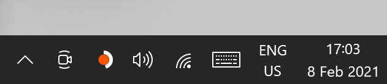
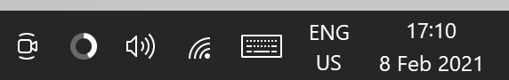

# Battery Status 
Shows the battery status in the Win10 system tray.

## Details
Personal project to make a good looking battery indicator.

Right click to enable charging animation. 
When charging, the empty part of the battery is visualized by a static grey color. Right clicking will animate this charging color.

Left click to enable stay awake mode (visible by the orange dot). 
In this mode your system will not go into screensaver, lock or sleep mode even when system administrators (policies) enforce it.

### ChangeLog
1.0.0 First working version 
1.1.0 Added stay awake functionality

