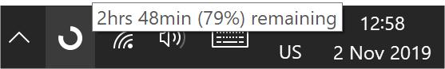

# Battery Status 
Shows the battery status in the Win10 system tray.

## Details
Personal project to make a good looking battery indicator.

### ChangeLog
1.0.0 First working version
1.1.0 Added stay awake functionality

